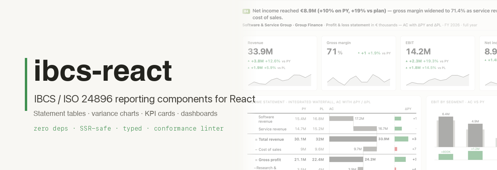
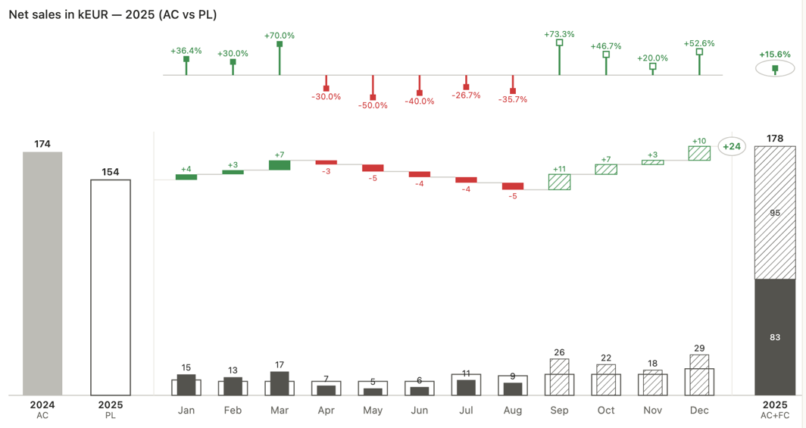
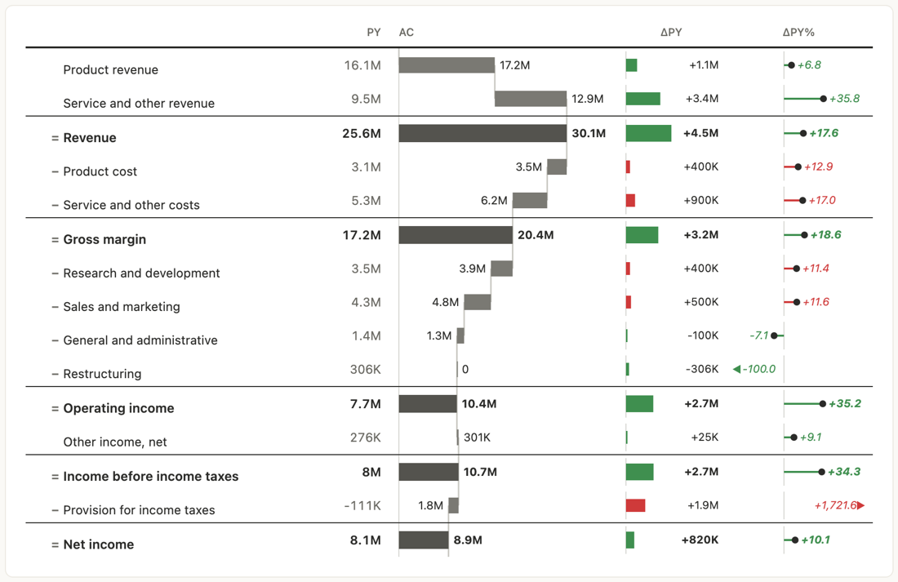
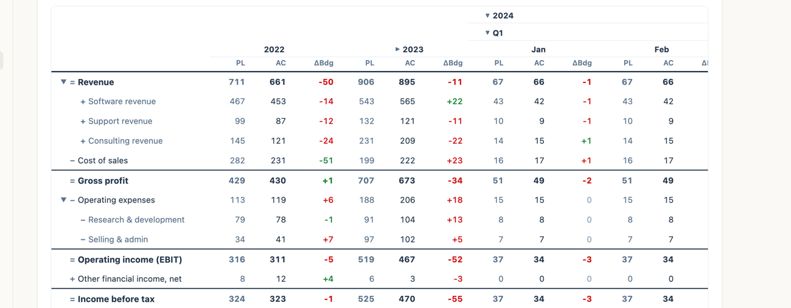
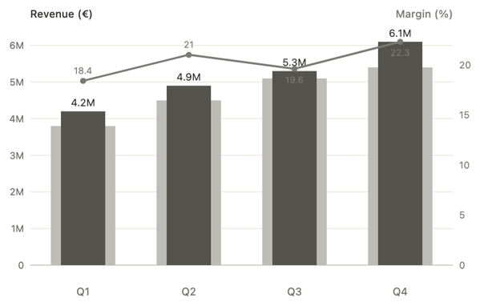
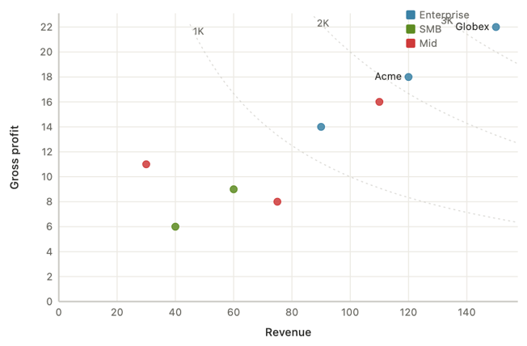
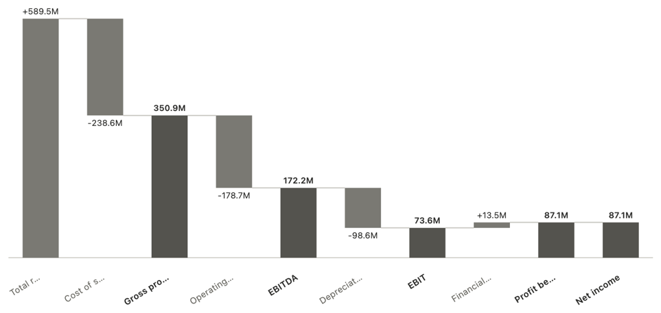
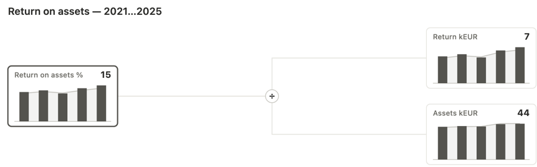
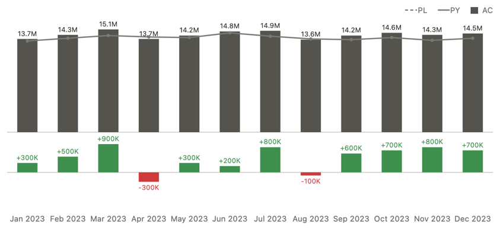
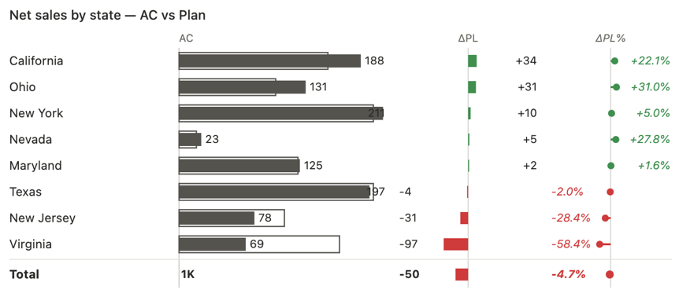

<div align="center">

<a href="https://ibcs-react.com"></a>

<p align="center">
  <a href="https://www.npmjs.com/package/ibcs-react"></a>
  <a href="./LICENSE"></a>
  
  
  
</p>

<p align="center">
  <b><a href="https://ibcs-react.com">Live demo &amp; docs&nbsp;→</a></b>
  &nbsp;·&nbsp; <a href="#components">Components</a>
  &nbsp;·&nbsp; <a href="#quick-start">Quick start</a>
  &nbsp;·&nbsp; <a href="#iso-24896-conformance">Conformance</a>
</p>

</div>

**ibcs-react** is a component library for **IBCS / ISO 24896** business reporting —
statement tables, variance charts, KPI cards and whole dashboards that encode the
standard so reports come out consistent, comparable and decision-ready.

> **One data model, many views.** The same statement feeds the table, the charts
> and the KPIs. Components never fetch — bring your data (a report engine, an API,
> static JSON) and they render a normalized model. Sign-explicit variances, four
> scenario fills (actual / previous / plan / forecast), shared scales, and a
> built-in `checkIbcs` conformance linter — among the first React libraries built
> around the IBCS / ISO 24896 notation.

<div align="center">

<br/>
<sub><i>The rolling forecast lands the year on plan: monthly AC vs PL columns, a variance bridge of the deviations, and the AC + FC year-end total — one chart, the whole story.</i></sub>
</div>

## Install

```bash
npm i ibcs-react
```

`react` and `react-dom` (>=18) are **peer dependencies** — they are not bundled.

**Try it without installing:** there's a runnable Next.js (App Router) starter in
[`examples/nextjs`](examples/nextjs) —
[**Open in StackBlitz ↗**](https://stackblitz.com/github/NibelungAI/ibcs-react/tree/main/examples/nextjs)
(works once `ibcs-react` is published to npm).

## AI agents

Building with a coding agent? Install the **ibcs-react skill** — IBCS notation
rules plus component recipes, packaged in the open `SKILL.md` format for Claude
Code, Cursor, Codex and 70+ other agents:

```bash
npx skills add NibelungAI/ibcs-react
```

Agents can also read the docs directly: [`ibcs-react.com/llms.txt`](https://ibcs-react.com/llms.txt)
(index), [`llms-full.txt`](https://ibcs-react.com/llms-full.txt) (whole corpus, one file),
or any docs page as raw Markdown by appending `.mdx` to its URL — e.g.
[`/docs/getting-started.mdx`](https://ibcs-react.com/docs/getting-started.mdx).

## Quick start

```tsx
import { KpiCard, StatementTable, Report } from "ibcs-react";
import type { StatementLine } from "ibcs-react";

// ONE data model — values keyed by scenario (AC actual / PY previous year /
// PL plan / FC forecast) — feeds every component.
const statement: StatementLine[] = [
  { id: "rev-product", label: "Product revenue", flow: "add", values: { AC: 17.2e6, PY: 16.1e6 } },
  { id: "rev-service", label: "Service revenue", flow: "add", values: { AC: 12.9e6, PY: 9.5e6 } },
  { id: "revenue", label: "Revenue", flow: "result", values: { AC: 30.1e6, PY: 25.6e6 } },
  {
    id: "cogs",
    label: "Cost of goods",
    flow: "subtract",
    higherIsBetter: false,
    values: { AC: 9.7e6, PY: 8.4e6 },
  },
  { id: "gm", label: "Gross margin", flow: "result", values: { AC: 20.4e6, PY: 17.2e6 } },
];

export function Dashboard() {
  return (
    <>
      <KpiCard
        label="Revenue"
        values={{ AC: 30.1e6, PY: 25.6e6 }}
        comparisons={["PY"]}
        format={{ compact: true, decimals: 1 }}
      />

      <StatementTable
        lines={statement}
        varianceColumns={[
          // right-hand variance panels, in order
          { base: "PY", mode: "abs", mark: "bar" }, // ΔPY as bars
          { base: "PY", mode: "pct", mark: "pin" }, // ΔPY% as pins
        ]} // ← this pair is also the default
        format={{ compact: true, decimals: 1 }}
      />
    </>
  );
}
```

Prefer to drive a whole page from data? Hand a `ReportConfig` to `<Report />`:

```tsx
<Report
  config={{
    title: { who: "ACME Group", what: "Revenue & margin", when: "FY 2026" },
    columns: 12,
    blocks: [
      {
        id: "k1",
        type: "kpi",
        span: 4,
        config: { label: "Revenue", values: { AC: 30.1e6, PY: 25.6e6 }, comparisons: ["PY"] },
      },
      {
        id: "k2",
        type: "kpi",
        span: 4,
        config: { label: "Gross margin", values: { AC: 20.4e6, PY: 17.2e6 }, comparisons: ["PY"] },
      },
      { id: "s1", type: "statement", span: 12, config: { lines: statement } },
    ],
  }}
/>
```

## The model

Everything is a tree of `StatementLine`s carrying one value per scenario
(`AC` actual, `PY` previous year, `PL` plan/budget, `FC` forecast):

- `flow`: `"add"` / `"subtract"` move the actual-column waterfall; `"result"`
  draws a full subtotal bar without moving the running total.
- `higherIsBetter`: set `false` on cost / expense / tax lines so an increase
  reads as **unfavorable** (red), even though the number is positive.
- `children`: any line can be a collapsible group whose children carry the flow.

## Components

All components are pure React + inline SVG. The library covers the **complete IBCS
template set** — every standard chart (C01–C13) and table (T01–T04):

| Group      | IBCS template                            | Component(s)                                               |
| ---------- | ---------------------------------------- | ---------------------------------------------------------- |
| **Tables** | T01 hierarchical · variance columns      | `DataTable`, `ComparisonTable`                             |
|            | T02 hierarchical · integrated bars       | `ComparisonTable`                                          |
|            | T03 / T04 P&L · integrated waterfall     | `StatementTable`                                           |
|            | Budget / control matrix                  | `MatrixTable`                                              |
| **Charts** | C01 / C02 stacked column / bar           | `StackedChart`                                             |
|            | C03 / C04 multi-tier grouped             | `GroupedVarianceChart`                                     |
|            | C05 columns + horizontal waterfall       | `ColumnVarianceWaterfallChart`, `HorizontalWaterfallChart` |
|            | C06 bars + vertical waterfall            | `BarVarianceWaterfallChart`                                |
|            | C07 line · C08 area                      | `LineChart` · `AreaChart`, `VarianceAreaChart`             |
|            | C09 scattergram · C10 bubble             | `ScatterChart` · `BubbleChart`                             |
|            | C11 calculation / ratio tree             | `TreeChart`, `RatioTreeChart`                              |
|            | C12 vertical waterfall(s) + variance     | `WaterfallChart`, `WaterfallStatementChart`                |
|            | C13 small multiples                      | `SmallMultiples`, `MiniVarianceMultiples`                  |
|            | _(extras)_ integrated / ranking variance | `IntegratedVarianceChart`, `RankingVarianceChart`          |

### Tables (IBCS templates T01–T04)

- **`StatementTable`** — the IBCS integrated waterfall (**T03/T04**): a P&L (flow)
  or balance sheet (`mode="stock"`) with embedded variance bars/pins, expand/
  collapse-all, optional virtualization (`maxHeight`) for large consolidations.
- **`DataTable`** — the general cross-entity comparison table (**T01**): rows =
  entities, columns = measures (values, embedded variance bars/pins, sparklines).
- **`ComparisonTable`** — the centre-label flanking layout (**T01/T02**): one
  measure with column groups (e.g. month vs YTD), each PY/PL/AC + variance.
- **`MatrixTable`** — a budget / control matrix: a P&L row tree crossed with an
  expanding period column tree (Year → Quarter → Month), PL/AC/FC sub-columns,
  ΔBudget, sticky first column + horizontal scroll, expand-all periods.

`StatementTable`, `DataTable` and `MatrixTable` follow the React
controlled/uncontrolled convention (`ComparisonTable` is a static layout with
no interactive state). Seed them and
let them own their state — `defaultCollapsed`, `defaultSort`,
`defaultExpandedRows` / `defaultExpandedCols` — or take the state over with
`collapsed` + `onCollapsedChange`, `sort` + `onSortChange`, `expandedRows` /
`expandedCols` + `onExpandedRowsChange` / `onExpandedColsChange`, for URL sync,
persistence or two views kept in step. The `on…Change` callbacks also fire in
uncontrolled mode, as observers.

<table>
<tr>
<td valign="top"><br/><sub><b>StatementTable</b> — a P&amp;L as an integrated waterfall, with PY/AC value columns and ΔPY / ΔPY% panels.</sub></td>
</tr>
<tr>
<td valign="top"><br/><sub><b>MatrixTable</b> — a budget / control matrix: the P&amp;L row tree crossed with a period column tree that drills Year → Quarter → Month in place, with a ΔBudget column.</sub></td>
</tr>
</table>

### Charts

- **`VarianceColumnChart`** — AC vs a comparison as overlapped columns (or pins)
  with an absolute/relative variance panel beneath.
- **`TrendChart`** — a many-period time series (built for 13): AC solid / FC
  hatched columns, PY & PL reference lines, variance panel.
- **`StructureChart`** — ranked horizontal bars for composition / contribution,
  AC vs PY overlap and % share.
- **`WaterfallChart`** — a standalone add / subtract / result bridge.
- **`StackedChart`** — stacked columns over time (**C01**) or stacked bars over
  a structure (**C02**), with category totals.
- **`LineChart`** — dense multi-series time lines with markers (**C07**).
- **`AreaChart`** — one scenario filled to the zero baseline (**C08**), optional
  reference line on top.
- **`ScatterChart`** — a value/value scattergram (**C09**) with optional
  constant-product iso-lines (e.g. equal gross profit).
- **`BubbleChart`** — two value axes plus a size dimension (**C10**).
- **`ComboChart`** — columns + a secondary-axis line.
- **`TreeChart`** / **`RatioTreeChart`** — a calculation / DuPont tree (**C11**):
  TreeChart shows a value per node, RatioTreeChart a mini time-series per node.
- **`GroupedVarianceChart`** — grouped two-scenario columns (**C03**) or bars
  (**C04**) with stacked absolute + relative variance tiers.
- **`IntegratedVarianceChart`** — the signature vertical 3-tier chart: Δ% pins /
  Δ bars / AC columns with a PY-solid or PL-frame reference + FY total.
- **`RankingVarianceChart`** — a sorted horizontal AC + plan-overlay chart with
  ΔPL bar and ΔPL% pin columns and a total row.
- **`HorizontalWaterfallChart`** — a horizontal bridge (**C05**); plus the
  composites **`ColumnVarianceWaterfallChart`** (**C05**),
  **`BarVarianceWaterfallChart`** (**C06**) and **`WaterfallStatementChart`**
  (**C12**, two side-by-side waterfalls + variance tiers).
- **`VarianceAreaChart`** — actual vs a reference with green/red gap fill and a
  hatched forecast tail.
- **`PieChart`** — a part-to-whole pie / donut and pie multiples. _IBCS
  discourages pies; `checkIbcs` flags them — included for the occasional share._
- **`SmallMultiples`** / **`MiniVarianceMultiples`** — a grid of the same chart
  repeated by a dimension (**C13**), with an opt-in shared scale (the IBCS CHECK rule).
- **`VarianceBar`** — the standalone variance bar/pin primitive used inside the
  tables and charts.

<table>
<tr>
<td width="50%" valign="top"><br/><sub><b>ComboChart</b> — revenue columns + a margin-% line on a second axis.</sub></td>
<td width="50%" valign="top"><br/><sub><b>ScatterChart</b> — a scattergram with constant-gross-profit iso-lines.</sub></td>
</tr>
<tr>
<td width="50%" valign="top"><br/><sub><b>WaterfallChart</b> — an add / subtract / result P&amp;L bridge.</sub></td>
<td width="50%" valign="top"><br/><sub><b>RatioTreeChart</b> — a DuPont tree, a mini trend per driver.</sub></td>
</tr>
<tr>
<td width="50%" valign="top"><br/><sub><b>TrendChart</b> — many periods, AC / FC vs PY with a variance panel.</sub></td>
<td width="50%" valign="top"><br/><sub><b>RankingVarianceChart</b> — sorted, with ΔPL bar &amp; ΔPL% pin columns.</sub></td>
</tr>
</table>

### KPI

- **`KpiCard`** — a headline figure (count-up animated) with impact-coloured
  deltas vs PY/PL and an optional sparkline; an `appearance` prop controls
  border / background / corner radius / accent bar / shadow. The unit comes from
  `format`: `currency` for a leading symbol (€30.1M), `suffix` for a trailing one
  (18.4%), stated once beside the headline.
- **`Sparkline`** — a tiny line / area / bar micro-chart for cards and cells.

### Sizing & states

- **`ChartBox`** / **`ResponsiveChart`** / **`ScrollChart`** — give a fixed-size
  chart its size: fit, alignment, padding and scroll (see [Sizing](#sizing)).
  (`ChartFrame` is still exported, now deprecated in favour of `ChartBox`.)
- **`Skeleton`** — a loading placeholder shaped like a chart / table / card,
  drawn as one self-animating SVG.
- **`ChartState`** — loading / error / empty / content in a single wrapper, made
  to pair with `useAsyncData` (`{ data, loading, error, refetch }`).
- **`ChartDataTable`** — a visually-hidden `<table>` of the numbers behind a
  chart, so screen readers get the values and not just a label.

### Report builder

- **`Report`** — renders a whole report from a JSON `ReportConfig`: a responsive
  grid of KPI / chart / statement / text / table blocks.
- **`ConfiguredChart`** — renders any chart from a single `ChartConfig` object
  (the discriminated `type` selects the component).

### Conformance

- **`checkIbcs`** — lint a `ChartConfig`, `KpiConfig` or `ReportConfig` against
  the ISO 24896 / IBCS rules; returns findings (error / warning / info).
- **`ConformanceReport`** — a React view that renders those findings.

### Hooks

`useStatement`, `useVariance`, `useVariances`, `useFilters`, `useLiveData`,
`useAsyncData` (API data with loading / refresh / abort / poll),
`useChartSelection` (click-to-filter), `useChartHover` (+ `ChartTooltip`),
`usePrefersReducedMotion`, `useMountGrow`, `useAnimatedValue`, `useCountUp`.

### Helpers

`downloadCSV`, `downloadTextFile`, `downloadSVG`, `downloadPNG`, `serializeSvg`
(browser-side export); `ExportMenu` (a ready SVG / PNG / CSV download menu).

## Sizing

Every chart takes an explicit pixel `width` / `height` — nothing measures itself
— so a render-prop wrapper resolves the size and the chart _re-renders_ at it.
Unlike scaling a bitmap, text and strokes stay crisp at any size.

- **`ChartBox`** — **the one to reach for**, and the primitive the others are
  presets of. `fit="scale"` (default) fills the available width at the chart's
  aspect ratio and stops shrinking at `minWidth` (scrolling past it); `"fixed"`
  always draws the intrinsic size and scrolls; `"contain"` scales to fit both
  dimensions and letterboxes the rest; `"fill"` stretches to the box. Add
  `align` / `verticalAlign`, `padding`, `background` and `scroll`. Use it unless
  you need a shorter spelling.
- **`ResponsiveChart`** — the minimal "fill the parent" wrapper: it measures its
  container with a `ResizeObserver` and hands integer `width`/`height` to the
  child. Give it an `aspect` to derive the height from the width (otherwise the
  measured height is used), with `minWidth` / `minHeight` / `maxHeight` clamps and
  an optional resize `debounce`.
- **`ChartFrame`** — **deprecated**, use `ChartBox`. It framed a chart
  image-style inside a fixed box (`fit="fill"` / `fit="contain"`, nine-point
  `align` / `verticalAlign`, `padding`, letterbox `background`) — all of which
  `ChartBox` does, with a `fit` union that is a superset of its two modes. It
  stays exported; just swap the tag name.
- **`ScrollChart`** — the "one dimension fills, the other scrolls" preset: set
  `height` and the width fills, scrolling below `minWidth`; set `width` and the
  height scrolls inside a `maxHeight` viewport. Use it for a 13-period trend or a
  wide table on a phone.

```tsx
<ChartBox width={760} height={300} fit="scale" minWidth={680}>
  {(w, h) => <TrendChart width={w} height={h} data={monthly} />}
</ChartBox>
```

All of them are SSR-safe: nothing is drawn until the container has been measured,
so a chart never receives `0` or `NaN` and there is no layout jump.

## One model, JSON config

KPIs, whole reports and the core chart set — 11 types (`varianceColumn`,
`trend`, `structure`, `waterfall`, `stacked`, `line`, `area`, `scatter`,
`bubble`, `combo`, `tree`) — are describable as plain serializable config
objects; the specialist charts (pie, the variance-waterfall family, small
multiples, ratio tree) are component-only. A report is data you can store,
diff and round-trip:

```tsx
import { ConfiguredChart, validateChartConfig, validateReportConfig } from "ibcs-react";

// Whatever the JSON editor / API / database hands you — hence `unknown`.
const raw: unknown = { type: "varianceColumn", data: quarterlyRevenue, comparison: "PY" };

const result = validateChartConfig(raw); // { ok: true, config } | { ok: false, error }
if (result.ok) return <ConfiguredChart config={result.config} />; // config is a typed ChartConfig
```

`validateReportConfig` does the same for a full `ReportConfig` before you hand
it to `<Report />`. Because configs are JSON, you can persist a dashboard, ship
it from a backend, or build a no-code editor on top.

## ISO 24896 conformance

Most chart libraries let you draw anything. This one can also **check** a config
against the IBCS notation — the basis of ISO 24896 — and tell you exactly where
it departs from the standard before it ships:

```tsx
import { checkIbcs } from "ibcs-react";

const findings = checkIbcs(reportConfig);
// [] when fully conforming; otherwise { rule, severity, message, ... } items,
// e.g. a bare-string title flagged for not using a Who/What/When structure.
```

Render the result with `<ConformanceReport findings={findings} />`. The encoded
rule set is exported as `IBCS_RULES`.

## Theming

All colors and scenario styles live in tokens and are overridable per component
via the `tokens` prop (deep-merged):

```tsx
import { StatementTable } from "ibcs-react";

<StatementTable lines={statement} tokens={{ color: { good: "#2e7d32", bad: "#c62828" } }} />;
```

Set the theme once for a whole subtree with `IbcsThemeProvider` instead of
threading a `tokens` prop into every component:

```tsx
import { IbcsThemeProvider, tokenPresets } from "ibcs-react";

<IbcsThemeProvider tokens={tokenPresets["CVD-safe"]}>
  <KpiCard label="Revenue" values={{ AC: 30.1e6, PY: 25.6e6 }} />
  <StatementTable lines={statement} />
  {/* nearest wins — this one chart departs from the theme */}
  <TrendChart data={monthly} tokens={{ color: { bad: "#c62828" } }} />
</IbcsThemeProvider>;
```

Resolution order, nearest first: a component's own `tokens` prop, merged onto the
nearest provider's theme, merged onto `defaultTokens`. Providers nest — an inner
provider composes onto the outer one, so a full preset and a one-line tweak are
the same operation. Building your own visual on `ibcs-react/core`?
`useIbcsTokens(override?)` resolves exactly what the built-ins resolve, so it
joins the same theme.

The eight ship presets are collected in `tokenPresets` (handy for a theme
switcher) and also exported one by one:

| `tokenPresets` key | Export           |
| ------------------ | ---------------- |
| `Default`          | `defaultTokens`  |
| `Ocean`            | `oceanTokens`    |
| `Azure`            | `azureTokens`    |
| `Green / Red`      | `greenRedTokens` |
| `Vivid`            | `vividTokens`    |
| `CVD-safe`         | `cvdTokens`      |
| `Mono / print`     | `monoTokens`     |
| `Dark`             | `darkTokens`     |

`mergeTokens(override, base?)` resolves a partial override into a full token set
(`base` defaults to `defaultTokens`, so presets compose), and `IbcsTokensOverride`
is the partial-token type to annotate your own theme objects with.

## Next.js & React Server Components

The root entry ships with a `"use client"` directive. The components use hooks
(hover, mount animation, container measurement), so importing `ibcs-react` from
an App Router page marks that import as client code and it just works — no
wrapper module of your own needed.

Server-side maths carries no such directive: import from `ibcs-react/core` in a
server component, a route handler, a cron job or a build script to precompute
statements, variances or a conformance check, then hand the plain data to a
client component that renders it. There's a runnable starter in
[`examples/nextjs`](examples/nextjs).

## `ibcs-react/core` — framework-agnostic

The pure logic ships under a separate entry with **zero React dependency**:

```ts
import {
  computeVariance,
  formatValue,
  statementToCSV,
  checkIbcs,
  defaultTokens,
} from "ibcs-react/core";
```

Reuse it to build a Vue/Svelte view, precompute statements on the server, or run
conformance checks in CI — no DOM required.

## License

[MIT](./LICENSE) © ibcs-react contributors

---

<sub>
ibcs-react is an independent open-source project whose components are built <b>in
accordance with</b> the IBCS&reg; notation and ISO&nbsp;24896. It is <b>not
affiliated with, endorsed by, or certified by</b> the IBCS Association, HICHERT+FAISST,
or ISO; conformance is self-assessed via the built-in <code>checkIbcs</code> linter and a
work in progress. “IBCS” is a trademark of its respective owner.
</sub>
